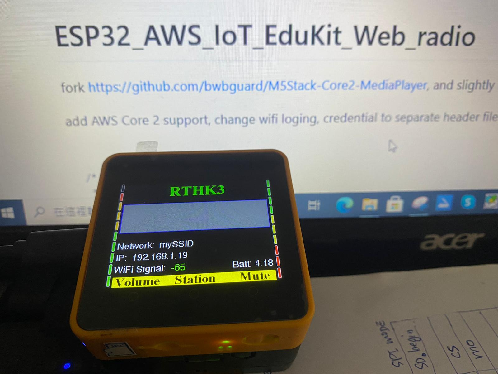

# ESP32_AWS_IoT_EduKit_Web_radio  

web radio for (ESP32) AWS IoT EduKit, it is 99% identical as m5stack Core2. see this https://github.com/xiaolaba/ESP32_AWS_IoT_EduKit_quick_test.

This complete code & fork https://github.com/bwbguard/M5Stack-Core2-MediaPlayer, and slightly modified to suit AWS Core2.   





add AWS Core 2 support, change wifi login credential to separate header file

```

/*
 * test for AWS CORE2
 * install FastLED, https://github.com/FastLED/FastLED/issues/373, WS2812 and SK6812 (of CORE2 FOR AWS) are equlivent
 * install M5Core2, https://github.com/m5stack/M5Core2 
 * via Arduino Library manager, will do.
 * 2021-06-21, test ok, xiaolaba
 * 
 */

// install https://github.com/FastLED/FastLED/issues/373, WS2812 and SK6812 are equlivent
#include "FastLED.h"
#include <ArduinoECCX08.h>

#define LEDS_PIN 25
#define LEDS_NUM 10
CRGB ledsBuff[LEDS_NUM];

ECCX08Class myECCX08(Wire1, 0x35);

// Enter your WiFi, Station, button settings here:
#include "xiaolabaWIFI.h";
//const char *SSID = "ENTER_SSID_HERE";
//const char *PASSWORD = "ENTER_WIFI_PASSWORD_HERE";
```


add Asia radios stations for testing, no CHT font displyesd, terminal debug string is ok, but not LCD  
```
const int stations = 12;// Change Number here if you add feeds!
char * stationList[stations][2] = {
  {"中文RTHK1", "http://stm2.rthk.hk:80/radio1"},
  {"RTHK2", "http://stm2.rthk.hk:80/radio2"},
  {"RTHK3", "http://stm2.rthk.hk:80/radio3"},
  {"RTHK4", "http://stm2.rthk.hk:80/radio4"},
  {"RTHK5", "http://stm2.rthk.hk:80/radio5"},
  {"Charlie FM", "http://24083.live.streamtheworld.com:80/KYCHFM_SC"},
  {"MAXXED Out", "http://149.56.195.94:8015/steam"},
  {"Orig. Top 40", "http://ais-edge09-live365-dal02.cdnstream.com/a25710"},
  {"Smooth Jazz", "http://sj32.hnux.com/stream?type=http&nocache=3104"},
  {"Smooth Lounge", "http://sl32.hnux.com/stream?type=http&nocache=1257"},
  {"Classic FM", "http://media-ice.musicradio.com:80/ClassicFMMP3"},
  {"Lite Favorites", "http://naxos.cdnstream.com:80/1255_128"}
};


```


setup, add volume preset,  

```
setup() {

  Serial.println("xiaolaba test, AWS IoT Edukit for web radio");
  audioGain = 8.0;  // preset
  
  changeVolume();  // To update Volume setting and graphic
  displayWiFiInformation();
}
```
